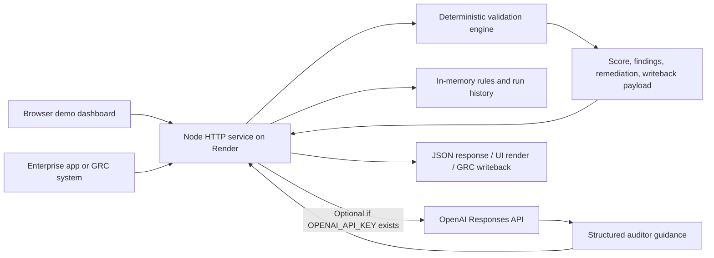

# Automated Data Validation: Security-First System Design Case Study

Source: June 30, 2026 PR `karanparmani/AutomatedDataValidation#1`, `[codex] Add cloud-ready validation web app`, plus the PR changed-file map and head files for concrete implementation notes.

## Executive Summary

The PR turns the original Android proof of concept into a cloud-ready Node web application and REST validation layer. The system accepts structured or unstructured audit evidence, applies Tier-1 standard QA rules and Tier-2 domain rules, returns a scored disposition with remediation findings, and can optionally generate AI auditor guidance when `OPENAI_API_KEY` is configured.

Security posture today is demo-oriented rather than production-ready. The design has a useful deterministic core, server-side API key handling, a small request body limit, production error redaction, and static path traversal protection. The main hardening gaps are public unauthenticated APIs, mutable global rule state, in-memory shared history, no tenant isolation, no rate limiting, and potential sensitive evidence egress to the OpenAI API when AI insights are enabled.

## Architecture

Core components:

- `web/server.js`: Node HTTP API and static file server.
- `web/lib/engine.js`: deterministic policy engine for evidence profiling, rule evaluation, scoring, findings, remediation logs, and writeback payload construction.
- `web/lib/store.js`: in-memory rule catalog mutation and reset behavior.
- `web/lib/intelligence.js`: optional OpenAI-backed auditor guidance with rule-engine fallback.
- `render.yaml`: Render web service using `rootDir: web`, `npm install`, `npm start`, `/api/health`, `NODE_ENV=production`, and commit-triggered deploys.

## Request Flow

1. Client sends evidence to `POST /api/validate` with `domainId`, `content`, and optional metadata such as `sourceSystem`, `workpaperId`, `fileName`, `fileType`, `dataMode`, and `createdBy`.
2. Server parses JSON and rejects missing `domainId` or `content`. Request bodies are capped at about 2 MB.
3. Server loads active rules from the in-memory rule store.
4. Validation engine profiles the evidence as structured or unstructured, applies standard QA and domain rules, computes score/status, and builds remediation findings.
5. If `includeIntelligence` is not `false`, the server requests AI guidance when `OPENAI_API_KEY` is configured. Otherwise it returns rule-based fallback guidance.
6. Server stores the newest run in process memory, capped at 50 records, and returns the validation result.
7. The UI can also call catalog, template, rules, history, history-clear, and intelligence endpoints.

## Trust Boundaries

- Internet to Render service: all requests entering Render should be treated as untrusted until authenticated, authorized, size-limited, and rate-limited.
- Browser UI to API: same-origin demo traffic is not proof of trust. API endpoints can be called directly by any external client unless auth is added.
- Evidence content to validation engine: uploaded/pasted evidence may contain sensitive audit data, malformed JSON, large text payloads, prompt-injection attempts, or intentionally expensive regex inputs.
- Rule-management API to rule store: rule create/update/delete/reset changes validation behavior globally today, so this is an administrative boundary.
- Server to OpenAI API: enabling AI insights creates a third-party data egress path for validation metadata, findings, and active rules. Evidence excerpts should be minimized and redacted before egress.
- Process memory to users: history and rules are global process state. Without tenant and user scoping, one user's state can affect another user's responses.
- Render environment to application: `OPENAI_API_KEY` should only exist as a server-side secret. It must never be exposed to browser JavaScript, static assets, logs, or API responses.

## Security Controls Already Present

- API key remains server-side and optional; the workflow falls back to deterministic guidance if AI is unavailable.
- JSON responses use `cache-control: no-store`.
- Production error responses suppress internal error detail.
- Static file serving normalizes paths and blocks traversal outside `web/public`.
- Request body parsing destroys oversized bodies above roughly 2 MB.
- Rule IDs are normalized and rule weights are bounded from 0 to 100.
- AI output is requested through a strict JSON schema, and deterministic rule findings remain the source of truth.

## Render Deployment Risks

- Public exposure: Render web services are internet reachable by default. The PR summary does not mention authentication, authorization, CORS policy, or admin protection.
- Free plan behavior: cold starts and resource limits can cause latency spikes, failed validation runs, and unreliable demos under bursts.
- Commit-triggered deploys: `autoDeployTrigger: commit` is convenient but increases blast radius if unreviewed changes land on the deploy branch.
- Ephemeral process memory: rules and history reset on restart and are inconsistent across instances, which is risky for audit traceability.
- Secret handling: `OPENAI_API_KEY` belongs in Render environment secrets only. Error diagnostics, logs, and client payloads should be reviewed to avoid leaking credentials or evidence.
- Supply chain: `npm install` runs at build time. Even with no listed runtime dependencies today, production should use lockfiles, pinned engines, vulnerability checks, and protected deploy branches.
- Health checks: `/api/health` is useful, but it should avoid exposing implementation details beyond liveness/readiness.

## Rate Limiting

Current state: no application-level rate limiting is described in the PR summary or present in the Node server. The only meaningful request guard is the 2 MB body cap.

Recommended policy:

- Require authentication before quota decisions; use tenant ID plus user/service identity as the primary key and IP as a secondary abuse signal.
- Apply lower limits to expensive endpoints: `POST /api/validate`, `POST /api/intelligence`, and rule mutation endpoints.
- Separate demo UI limits from enterprise integration limits.
- Add concurrent request caps and outbound OpenAI timeout/retry budgets.
- Return `429` with `Retry-After` and structured error bodies.
- Add Render or edge-level protection for burst traffic before requests reach Node.

Example starting limits:

| Endpoint class | Suggested limit | Reason |
| --- | ---: | --- |
| Health/catalog/templates | 120 requests/minute per IP | Low cost, read-only |
| Validate | 30 requests/minute per tenant, 5 concurrent | CPU and optional AI cost |
| Intelligence | 10 requests/minute per tenant, 2 concurrent | External API cost and data egress |
| Rule mutations | 10 requests/minute per admin | High integrity impact |
| History clear/reset | 3 requests/minute per admin | Destructive workflow impact |

## Multitenancy Assumptions

The current PR should be treated as single-tenant demo software. It has global in-memory rules, global in-memory history, user-supplied `sourceSystem` and `createdBy`, and no identity boundary. In that model, all users share one validation catalog and one run history.

For production multitenancy, assume each customer, business unit, or GRC workspace needs separate:

- Authentication and tenant membership.
- Rule catalogs and rule version history.
- Validation run history and retention policy.
- OpenAI configuration, data residency choices, and model policy.
- Admin roles for rule changes, history clearing, and integration credentials.
- Audit logs that record actor, tenant, request ID, rule version, and writeback target.

## Next-Step Hardening Recommendations

1. Add authentication and authorization before exposing Render publicly. Protect rule mutation, reset, history, and intelligence endpoints with admin or service roles.
2. Introduce tenant-scoped persistence. Move rules and history out of process memory into a database with tenant IDs, row-level access checks, immutable run records, and retention controls.
3. Add rate limiting, request timeouts, and concurrency caps. Budget OpenAI calls separately from deterministic validations.
4. Minimize AI egress. Send only findings, metadata, and necessary excerpts; redact secrets, account numbers, emails, tokens, and regulated data before calling external models.
5. Add security headers and CORS policy. Use a small allowlist, `Content-Security-Policy`, `X-Content-Type-Options`, `Referrer-Policy`, and frame restrictions.
6. Harden rule execution. Guard configurable regex rules against catastrophic backtracking, validate matcher inputs, version rule changes, and require approvals for production rule edits.
7. Add audit logging. Log request ID, tenant, actor, endpoint, decision status, rule version, latency, and external AI status without logging raw evidence.
8. Protect deploys. Use protected branches, required PR reviews, lockfiles, dependency scanning, secret scanning, and separate preview/production Render services.
9. Make health checks boring. Return liveness/readiness only; keep version and environment details internal.
10. Add abuse and privacy tests. Cover oversized payloads, invalid JSON, unauthenticated access, cross-tenant history access, rule tampering, prompt-injection content, AI failure fallback, and Render restart behavior.

## Production Readiness Bar

The PR is a strong cloud demo: it exposes a clear REST contract, deterministic validation semantics, browser workflow, optional AI guidance, and Render/Docker deployment paths. It should not be positioned as production security-ready until identity, tenancy, persistence, rate limiting, audit logging, data minimization, and deployment controls are in place.
